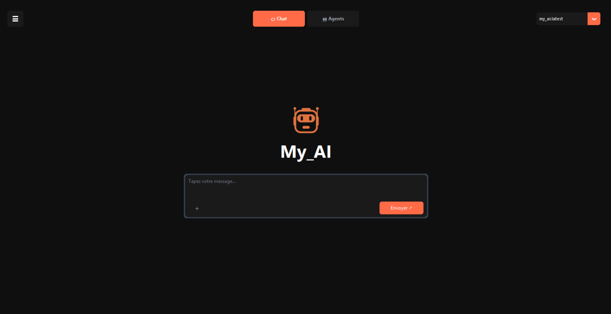
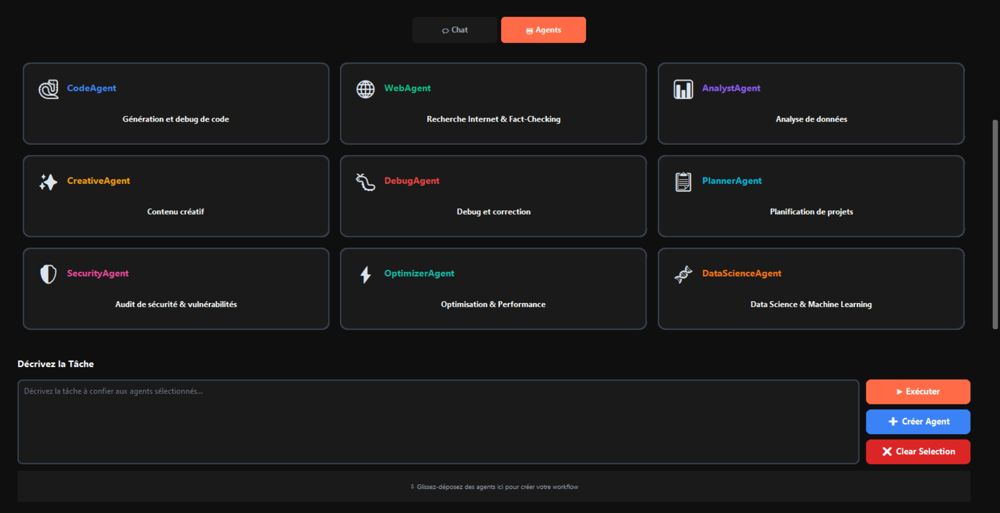

<div align="center">

# 🤖 My AI — Une IA personnelle, confidentielle et locale

**Puissante · 100% locale · Extensible**

[](https://www.python.org/)
[](https://ollama.com/)
[](https://github.com/gonicolas12/My_AI)
[](LICENSE)
[](docs/ULTRA_1M_TOKENS.md)

*Une IA qui tourne entièrement sur votre machine. Vos données ne quittent jamais votre ordinateur.*

[🏃‍♂️ Démarrage rapide](#️-démarrage-rapide) · [📖 Documentation](#-documentation-complète) · [🤖 Agents IA](#-système-dagents-ia-spécialisés) · [🔧 Caractéristiques Techniques](#-caractéristiques-techniques)

</div>

---

## ✨ Points Forts

<table>
<tr>
<td width="50%">

**🧠 Mémoire Vectorielle Étendue**  
Jusqu'à 1 048 576 tokens stockés en mémoire interne (ChromaDB + SQLite).

**💬 Conversations Intelligentes**  
Reconnaissance d'intentions avancée, mémoire persistante et compréhension contextuelle.

**🤖 9 Agents IA Spécialisés**  
Code, Web, Analyse, Créativité, Debug, Sécurité... et création d'agents personnalisés.

**🎓 RLHF Intégré**  
Chaque feedback enrichit votre base d'entraînement personnelle pour affiner le modèle à votre usage.

</td>
<td width="50%">

**📄 Traitement de Documents**  
PDF, DOCX, images — analyse contextuelle ultra-étendue avec compression intelligente.

**🌐 Recherche Internet**  
Accès aux informations en temps réel via DuckDuckGo, résumés automatiques inclus.

**💻 Génération de Code**  
Analyse et génération de code avec contexte massif et orchestration intelligente.

**🏗️ Architecture 100% Locale**  
SQLite, ChromaDB, aucune dépendance cloud. Vos données restent chez vous.

</td>
</tr>
</table>

---

## 🖥️ Interface Utilisateur

<div align="center">

### Chat — Interface style [Claude](https://claude.ai/new)



| Fonctionnalité | Détail |
|---|---|
| 🎨 **Design moderne** | Interface sombre élégante avec bulles de chat optimisées |
| ✨ **Formatage avancé** | Support complet du **texte en gras** Unicode et blocs de code colorisés |
| 🖱️ **Raccourcis clavier** | `Entrée` envoyer · `Shift+Entrée` nouvelle ligne · `Ctrl+L` clear |
| 🎓 **Feedback RLHF** | Boutons 👍 / 👎 sous chaque réponse, enregistrement automatique |

### Agents — Interface dédiée



| Fonctionnalité | Détail |
|---|---|
| 🤖 **Vue d'ensemble** | Liste claire de tous les agents avec rôles et descriptions |
| ⚡ **Lancement rapide** | Démarrage d'agents spécialisés en un clic |
| 🧩 **Création d'agents personnalisés** | Interface de création d'agents sur mesure |
| 📊 **Statistiques en temps réel** | Affichage des métriques de performance |

</div>

---

## 🚀 Fonctionnalités Principales

### 🤖 Système d'Agents IA Spécialisés

| Agent | Rôle |
|---|---|
| 🐍 **CodeAgent** | Génération et debug de code multi-langages |
| 🌐 **WebAgent** | Recherche Internet & Fact-Checking |
| 📊 **AnalystAgent** | Analyse de données et insights |
| ✨ **CreativeAgent** | Rédaction et contenu créatif |
| 🐛 **DebugAgent** | Détection et correction d'erreurs |
| 📋 **PlannerAgent** | Planification de projets complexes |
| 🛡️ **SecurityAgent** | Audit de sécurité & vulnérabilités |
| ⚡ **OptimizerAgent** | Optimisation & Performance |
| 🧬 **DataScienceAgent** | Data Science & Machine Learning |

> **Workflows multi-agents** : Les agents collaborent entre eux pour les tâches complexes. Créez aussi vos propres agents via l'interface ou les commandes `agent` / `workflow` en CLI.

---

### 🦙 Intégration Ollama — LLM 100% Local

- **Confidentialité totale** : aucune donnée envoyée sur internet
- **Fallback intelligent** : sans Ollama, l'IA bascule automatiquement en mode patterns/règles
- **Modèle personnalisable** : température, contexte, system prompt via le `Modelfile`
- **Multi-modèles** : texte (`llama3.2`, `llama3.1:8b`) et vision (`llama3.2-vision`, `llava`)

---

### 📚 FAQ Thématique Prioritaire

- Placez vos fichiers d'enrichissement dans `data/enrichissement/`
- Chargement automatique — toutes les Q/R sont fusionnées et accessibles instantanément
- La FAQ répond **avant** tout autre modèle (priorité maximale)
- Ajoutez, modifiez ou supprimez des fichiers à la volée

---

### 🌐 Recherche Internet Intelligente

- Recherche web en temps réel via **DuckDuckGo**
- Résumés automatiques et extraction de contenu avec **BeautifulSoup**
- Traitement parallèle de plusieurs sources simultanément
- Adaptation du format de réponse selon le type de recherche

---

## 💥 Capacités Techniques


| Capacité | Valeur |
|---|---|
| 🧠 Mémoire vectorielle interne | jusqu'à **1 048 576 tokens** |
| 📝 Résumé glissant | automatique dès 24k tokens |
| 📦 Compression texte | jusqu'à 52:1 |
| 🔍 Recherche sémantique | TF-IDF + similarité cosinus |
| 🗃️ Base vectorielle | ChromaDB (local) |
| 💾 Persistance | SQLite optimisé |


- **Compression intelligente multi-niveaux** : texte, code, documents
- **Chunking intelligent** avec détection automatique de blocs logiques
- **Auto-optimisation** de la mémoire selon l'usage
- **Métriques de compression exposées** : ratios détaillés de 2.4:1 à 52:1

---

## 🏗️ Architecture du Projet

```
my_ai/
├── core/                                # Cœur de l'IA
│   ├── __init__.py
│   ├── agent_orchestrator.py            # Orchestrateur d'agents
│   ├── ai_engine.py                     # Moteur principal IA
│   ├── compression_monitor.py           # Moniteur de compression (ratios, métriques)
│   ├── context_manager.py               # Gestion de contexte long
│   ├── conversation.py                  # Gestion des conversations
│   ├── data_preprocessing.py            # Prétraitement des données
│   ├── rlhf_manager.py                  # RLHF intégré (feedback automatique)
│   ├── rlhf.py                          # RLHF CLI (legacy)
│   ├── training_manager.py              # Training Manager moderne (pipeline complet)
│   └── training_pipeline.py             # Pipeline d'entraînement local
├── data/                                # Données d'enrichissement FAQ
│   ├── enrichissement/                  # Exemples thématiques
│   └── data_collection.py               # Script de structuration des données
├── docs/                                # Documentations
│   examples/                            # Exemples d'utilisation
│   └── advanced_features_demo.py        # Démo RLHF, Training, Compression
├── generators/                          # Générateurs de contenu
│   ├── __init__.py
│   ├── document_generator.py            # Génération docs avec contexte étendu
│   └── code_generator.py                # Génération code avec analyse ultra
├── interfaces/                          # Interfaces utilisateur Ultra
│   ├── __init__.py
│   ├── agents_interface.py              # Interface graphique Agents IA
│   ├── cli.py                           # Interface ligne de commande
│   ├── gui_modern.py                    # Interface moderne
│   ├── modern_styles.py                 # Styles et thèmes modernes
│   └── vscode_extension.py              # Extension VS Code
├── memory/                              # Mémoire vectorielle
│   ├── vector_store/chroma_db/          # Base de données ChromaDB
│   ├── __init__.py
│   └── vector_memory.py                 # Mémoire vectorielle avec ChromaDB
├── models/                              # Modèles d'IA
│   ├── mixins/                          # Mixins pour custom_ai_model
│   ├── training_runs/                   # Enregistrements des runs d'entraînement
│   ├── weights/                         # Poids de modèles entraînés localement
│   ├── __init__.py
│   ├── advanced_code_generator.py       # Générateur de code avancé
│   ├── ai_agents.py                     # Agents IA spécialisés
│   ├── base_ai.py                       # Interface de base
│   ├── conversation_memory.py           # Mémoire conversationnelle avancée
│   ├── custom_ai_model.py               # Modèle IA principal avec intentions
│   ├── intelligent_code_orchestrator.py # Orchestrateur pour la génération de code
│   ├── intelligent_document_analyzer.py # Analyseur de documents intelligent
│   ├── internet_search.py               # Moteur de recherche internet
│   ├── knowledge_base.py                # Base de connaissances locale
│   ├── linguistic_patterns.py           # Reconnaissance d'intentions et patterns
│   ├── local_llm.py                     # Gestionnaire Ollama (détection + fallback)
│   ├── ml_faq_model.py                  # FAQ avec ML et fuzzy matching
│   ├── real_web_code_generator.py       # Générateur de Code Basé sur Recherche Web Pure
│   ├── reasoning_engine.py              # Moteur de raisonnement logique
│   ├── smart_code_searcher.py           # Recherche de code intelligente
│   ├── smart_web_searcher.py            # Système de Recherche Web Intelligent pour Code
│   └── ultra_custom_ai.py               # Modèle ULTRA
├── outputs/                             # Fichiers générées par l'IA
├── processors/                          # Processeurs de fichiers Ultra
│   ├── __init__.py
│   ├── pdf_processor.py                 # Traitement PDF avec chunking intelligent
│   ├── docx_processor.py                # Traitement DOCX avec compression
│   └── code_processor.py                # Traitement de code avec analyse sémantique
├── tests/                               # Tests unitaires
├── tools/                               # Outils
├── utils/                               # Utilitaires Ultra
│   ├── __init__.py
│   ├── file_manager.py                  # Gestion fichiers
│   ├── file_processor.py                # Gestion traitement fichiers
│   ├── intelligent_calculator.py        # Calculateur intelligent
│   ├── logger.py                        # Gestion des logs
│   └── validators.py                    # Validateurs et utilitaires divers
├── main.py                              # Point d'entrée principal
├── Modelfile                            # Configuration modèle Ollama
├── requirements.txt                     # Dépendances
├── launch.bat                           # Script pour lancer le programme
├── clean_project.bat                    # Script pour supprimer les fichiers temporaires
├── create_custom_model.bat              # Script pour créer un modèle personnalisé Ollama
└── config.yaml                          # Configuration
```

---

## 🏃‍♂️ Démarrage Rapide

### 1 · Cloner le dépôt

```bash
git clone https://github.com/gonicolas12/My_AI
cd My_AI
```

### 2 · Installer les dépendances

```bash
pip install -r requirements.txt
```

### 3 · Installer Ollama *(Optionnel mais Recommandé)*

> **Sans Ollama**, l'IA fonctionne en mode fallback avec des patterns/règles.

```bash
# Télécharger depuis https://ollama.com/download, puis :

# Modèle texte (choisir selon votre RAM)
ollama pull llama3.2         # Léger — réponses rapides  (8 GB RAM)
ollama pull llama3.1:8b      # Lourd — réponses détaillées (16 GB RAM)

# [OPTIONNEL] Modèle vision pour l'analyse d'images
ollama pull llama3.2-vision  # Recommandé
ollama pull llava             # Alternative plus légère

# Créer le modèle personnalisé
.\create_custom_model.bat
```

> **Note** : Adaptez la 3ème ligne du `Modelfile` selon le modèle choisi (`llama3.2` ou `llama3.1:8b`). Après toute modification du `Modelfile`, relancez `create_custom_model.bat` pour appliquer les changements.

### 4 · Lancer l'application

```bash
.\launch.bat
```

Sélectionnez **l'option 1 (Interface Graphique)**, puis patientez.

> 💡 L'interface intègre des **boutons de feedback** sous chaque réponse de l'IA. Chaque feedback est automatiquement enregistré pour améliorer le modèle.

### 🧹 Nettoyage en cas de problème

```bash
.\clean_project.bat
```

Si vous observez des comportements inattendus ou des erreurs après plusieurs lancements, ce script supprime tous les fichiers temporaires (logs, caches, historiques) pour repartir sur une base propre.

---

## 🔑 Clé API GitHub *(pour la génération de code sans Ollama)*

Si [Ollama](#3--installer-ollama-optionnel-mais-recommandé) n'est pas installé, la génération de code nécessite une clé API GitHub.

### Générer un token

1. Rendez-vous sur [github.com/settings/tokens](https://github.com/settings/tokens)
2. Cliquez sur **"Generate new token"** (classic ou fine-grained)
3. Accordez les permissions nécessaires (`repo`, `user`, etc.)
4. Copiez la clé générée

### Configurer le token

```powershell
$env:GITHUB_TOKEN="votre_token_github"
```

> Sans clé, l'IA utilise automatiquement le backend local et les fonctionnalités GitHub sont désactivées. Consultez `config.yaml` pour personnaliser les backends et modèles.

---

<div align="center">

## 📖 Documentation Complète

| Document | Description |
|---|---|
| [🏗️ Architecture](docs/ARCHITECTURE.md) | Structure technique détaillée |
| [📦 Installation](docs/INSTALLATION.md) | Guide d'installation complet |
| [🌐 Recherche Internet](docs/INTERNET_SEARCH.md) | Guide complet sur la recherche web |
| [⚡ Optimisation](docs/OPTIMIZATION.md) | Conseils et techniques d'optimisation locale |
| [🧠 Mémoire Vectorielle 1M](docs/ULTRA_1M_TOKENS.md) | Détails sur la gestion de la mémoire interne étendue |
| [📋 Usage](docs/USAGE.md) | Exemples d'utilisation et workflows |
| [📝 Changelog](docs/CHANGELOG.md) | Historique des mises à jour |
| [❓ FAQ](docs/FAQ.md) | Questions fréquentes et réponses détaillées |
| [📄 Génération de Fichiers](docs/FILE_GENERATION.md) | Guide sur la génération de fichiers via l'IA |
| [🤖 Agents IA](docs/AGENTS.md) | Documentation complète sur les agents spécialisés |
| [🎓 Fonctionnalités Avancées](docs/ADVANCED_FEATURES.md) | RLHF, Training, Compression |
| [💬 Feedback GUI](docs/GUI_RLHF_FEEDBACK.md) | Boutons de feedback dans l'interface graphique |

---

## 🔧 Caractéristiques Techniques


| Caractéristique | Description |
|---|---|
| 🎓 **RLHF** | Apprentissage automatique depuis le feedback utilisateur |
| 🔁 **Pipeline d'entraînement** | Fine-tuning moderne avec monitoring temps réel |
| 📦 **Compression intelligente** | Ratios détaillés et métriques exposées |
| 🌐 **Hybride Local/Internet** | IA locale avec recherche internet optionnelle |
| 💻 **Multiplateforme** | Windows · macOS · Linux |
| 🪶 **Léger** | Fonctionnement optimal sur machines modestes |
| 🔩 **Extensible** | Architecture modulaire pour ajouts futurs |
| 🔒 **Sécurisé** | Données locales protégées, recherche internet anonyme |

</div>

---

## 🔮 Évolutions Futures

- 📊 **Amélioration de l'interface**
- 🌐 **Application Web**
- 💻 **Extension VS Code**
- 🧩 **Nouveaux agents spécialisés**
- 🔄 **Intégration avec d'autres LLM locaux**

---

<div align="center">

*Construit avec ❤️ pour rester local, privé et puissant.*

</div>
