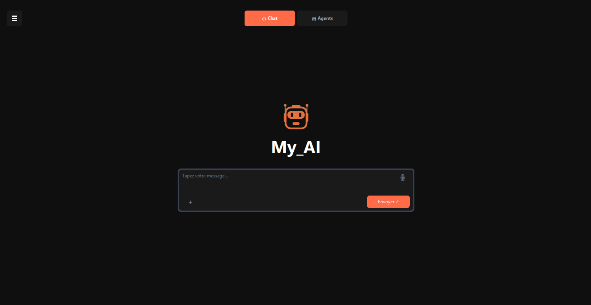
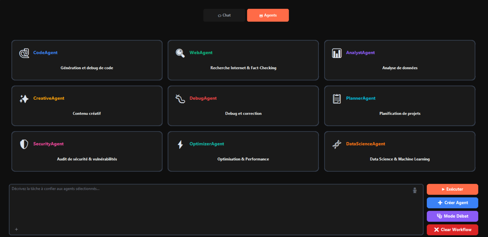
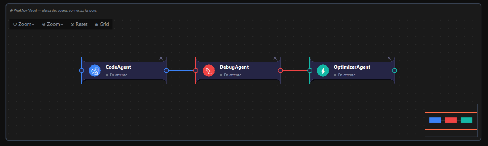

<div align="center">

# 🤖 My AI — Une IA personnelle, confidentielle et locale

**Puissante · Locale · Extensible**

[](https://www.python.org/)
[](https://ollama.com/download)
[](https://github.com/gonicolas12/My_AI)
[](LICENSE)
[](docs/ULTRA_10M_TOKENS.md)

*Une IA qui tourne entièrement sur votre machine. Vos données ne quittent jamais votre ordinateur.*

[🚀 Démarrage rapide](#-démarrage-rapide) · [🤖 Agents IA](#-système-dagents-ia-spécialisés) · [📡 My_AI Relay](#-my_ai-relay--accès-mobile) · [🧩 Extension VS Code](#-extension-vs-code) · [📖 Documentation](#-documentation-complète)

</div>

---

## ✨ Points Forts

<table>
<tr>
<td width="50%">

**💾 Mémoire Vectorielle Étendue**  
Jusqu'à 10 485 760 tokens stockés en mémoire interne (ChromaDB + SQLite).

**🤖 9 Agents IA Spécialisés**  
Code, Debug, Web, Sécurité... et création d'agents personnalisés avec interface style n8n.

**🧠 Mode Thinking**  
Pour les requêtes complexes, l'IA réfléchit étape par étape avant de répondre.

**🔌 Intégration MCP (Model Context Protocol)**  
Connexion standardisée à des outils locaux et serveurs externes (fichiers, git, bases de données).

**📅 Tâches Planifiées (proactif)**  
Planifiez vos agents et workflows en récurrence, exécution même l'application fermée.

</td>
<td width="50%">

**🔍 Recherche Internet**  
Accès aux informations en temps réel via DuckDuckGo. Résumés automatiques inclus.

**📄 Traitement de Documents**
PDF, DOCX, Excel, CSV, Code, images, analyse contextuelle ultra-étendue avec compression intelligente.

**📡 Accès Mobile**  
Discutez avec votre IA depuis votre téléphone, où que vous soyez, via un tunnel sécurisé.

**💻 Extension VS Code agentique**  
Façon Claude Code : lecture, édition, création de fichiers... le tout via le tunnel chiffré.

**🎙️ Voix locale**  
Dictée via faster-whisper dans toutes les zones de saisie, et lecture vocale des réponses.

</td>
</tr>
</table>

---

## 🖥️ Interface Utilisateur

<div align="center">

### Chat — Interface style [Claude](https://claude.ai/new)



| Fonctionnalité | Détail |
|---|---|
| 🧠 **Mode Thinking** | Widget de raisonnement animé pour les requêtes complexes |
| 🧭 **Barre latérale** | Relay, réglages, sessions, historique, exports, base de connaissances |
| 🎓 **Feedback RLHF** | Notation 1-5 étoiles, feedback enregistré automatiquement |
| 🎙️ **Saisie vocale** | Bouton micro dans la zone de saisie, transcription locale au curseur |
| 🔊 **Lecture vocale** | Bouton sous chaque réponse + mode lecture auto (langue auto-détectée) |
| 🎨 **Aperçu Artifacts** | Volet de rendu live HTML/CSS/SVG à côté du chat |

### Agents — Interface dédiée




| Fonctionnalité | Détail |
|---|---|
| 🤖 **Vue d'ensemble** | Liste claire de tous les agents avec rôles et descriptions |
| 🧩 **Création d'agents personnalisés** | Interface de création d'agents sur mesure |
| 🔄 **Canvas de workflow visuel** | Nœuds connectables, zoom/pan, grille, minimap |
| 🎭 **Mode Débat** | Confrontation argumentée entre deux agents |
| 📊 **Statistiques et monitoring ressources** | CPU, RAM, GPU, VRAM, temps d'inférence et tokens/s |
| 📅 **Tâches planifiées** | Agents en récurrence, même l'appli fermée |

</div>

---

## ⚡ Fonctionnalités Principales

### 🤖 Système d'Agents IA Spécialisés

| Agent | Rôle |
|---|---|
| 🐍 **CodeAgent** | Génération et debug de code multi-langages |
| 🔍 **WebAgent** | Recherche Internet & Fact-Checking |
| 📊 **AnalystAgent** | Analyse de données et insights |
| ✨ **CreativeAgent** | Rédaction et contenu créatif |
| 🐛 **DebugAgent** | Détection et correction d'erreurs |
| 📋 **PlannerAgent** | Planification de projets complexes |
| 🛡️ **SecurityAgent** | Audit de sécurité & vulnérabilités |
| ⚡ **OptimizerAgent** | Optimisation & Performance |
| 🧬 **DataScienceAgent** | Data Science & Machine Learning |

### 🦙 Intégration Ollama — LLM 100% Local

- **Confidentialité totale** : aucune donnée envoyée sur internet
- **Fallback intelligent** : sans Ollama, l'IA bascule automatiquement en mode patterns/règles
- **Modèle personnalisable** : température, contexte, system prompt via le `Modelfile`
- **Multi-modèles** : texte (`qwen3.5:2b`, `qwen3.5:4b`, `mistral`...) et vision (`minicpm-v`, `llava`, `llama3.2-vision`...)

### 🔍 Recherche Internet Intelligente

- Recherche web en temps réel via **DuckDuckGo**
- Résumés automatiques et extraction de contenu avec **BeautifulSoup**
- Traitement parallèle de plusieurs sources simultanément
- Adaptation du format de réponse selon le type de recherche

### 🔌 Accès à tout le PC (Root System) via MCP Local
- Outils locaux pour **lire, écrire, déplacer des fichiers** et **créer des dossiers**
- Vérification rigoureuse des **chemins complets** retournés par les outils pour garantir une **gestion précise** des fichiers
- Capacité à **organiser les espaces de travail** de manière autonome
- Dialogue de **confirmation** avant toute **suppression de fichier** (sécurité utilisateur)

### 🎙️ Saisie Vocale (Voice Mode)

- **Bouton micro** en haut-droite de chaque zone de saisie (chat accueil, chat conversation, onglet Agents)
- **Toggle** : 1er clic démarre l'écoute (icône rouge pulsante), 2ème clic stoppe et lance la transcription
- **100% local** via [faster-whisper](https://github.com/SYSTRAN/faster-whisper) — modèle `small` (~150 Mo) chargé à la demande
- **Langue auto-détectée** (99+ langues supportées par Whisper)
- **Insertion au curseur** de la zone active — pratique pour dicter des prompts longs sans interrompre sa frappe

### 🔊 Sortie Vocale (lecture des réponses)

- **Bouton 🔊** sous chaque réponse de l'IA (1er clic = lecture, 2e clic = stop) + **toggle « Lecture auto »** dans la sidebar pour lire chaque nouvelle réponse
- **100% local** via [pyttsx3](https://pyttsx3.readthedocs.io/) (moteur de l'OS — SAPI5 Windows / NSSpeechSynthesizer macOS / espeak-ng Linux) — aucun téléchargement
- **Voix choisie automatiquement selon la langue détectée** de la réponse (évite l'accent anglais sur du texte français)
- Code, markdown, URLs et emojis retirés avant lecture pour une **prose naturelle**

### 🧭 Premier lancement & ⚙️ Réglages

- **Assistant de configuration** au tout premier démarrage : détecte le matériel (RAM, cœurs CPU, VRAM GPU), **recommande le modèle adapté** (priorité à la fluidité), le télécharge et crée le modèle personnalisé `my_ai` — fini l'édition manuelle de `config.yaml`/`Modelfile`
- **Panneau ⚙️ Réglages** intégré : gestion des modèles Ollama (lister / pull / régénérer `my_ai`), température, fenêtre de contexte, timeout, langue, lecture auto — le tout en **préservant les commentaires** de `config.yaml`

### 🎨 Aperçu Artifacts (HTML / CSS / SVG)

- Quand l'IA génère du **HTML/CSS/SVG**, un bouton **« 🔍 Aperçu »** apparaît sous la réponse → un **volet de prévisualisation live** s'ouvre à côté du chat (façon *Claude Artifacts*)
- **Desktop** : rendu **Chromium exact** via **Edge `--app` embarqué** (ré-parenté dans un volet redimensionnable, **sans dépendance Python supplémentaire**) ; replis automatiques `tkinterweb` puis code source + bouton 🌐
- **Mobile (Relay)** : rendu en **`<iframe sandbox>`** isolée (aucune requête réseau), bouton 🌐 pour ouvrir dans un onglet
- **100% local** — détails et compromis dans [docs/ARTIFACTS_PREVIEW.md](docs/ARTIFACTS_PREVIEW.md)

### 📅 Tâches Planifiées (assistant proactif)

- Planifiez l'exécution **récurrente** d'un **agent**, d'un **workflow** (canvas n8n) ou d'un **débat** : *quotidien*, *hebdomadaire*, *intervalle* ou **cron** — ex. « chaque matin 8h, WebAgent sur l'actu IA et résume »
- **Exécution même l'application fermée** (option) via le **Planificateur de tâches Windows** — session ouverte, sans droits admin ni mot de passe stocké
- **Rattrapage** des tâches manquées au redémarrage, **notifications** (toast OS + entrée GUI + message mobile), rapports `.md` dans `outputs/scheduled/`
- 100% local, **réutilise l'orchestrateur d'agents existant** — voir [docs/SCHEDULER.md](docs/SCHEDULER.md)

---

## 💥 Capacités Techniques


| Capacité | Valeur |
|---|---|
| **💾 Mémoire vectorielle interne** | jusqu'à **10 485 760 tokens** |
| **📝 Résumé glissant** | automatique dès 24k tokens |
| **🔍 Recherche sémantique** | sentence-transformers + HNSW cosinus |
| **🗃️ Base vectorielle** | ChromaDB (local) |


- **Chunking intelligent** avec chevauchement configurable (chunk 256 tokens, overlap 32)
- **Auto-optimisation** de la mémoire selon l'usage (éviction FIFO)
- **Métriques de chunking exposées** : overhead de chevauchement, taille moyenne des chunks

---

## 🏗️ Architecture du Projet

```
my_ai/
├── core/                                # Cœur de l'IA
│   ├── __init__.py
│   ├── agent_orchestrator.py            # Orchestrateur d'agents
│   ├── ai_engine.py                     # Moteur principal IA
│   ├── api_server.py                    # Serveur API REST (FastAPI)
│   ├── chat_orchestrator.py             # Orchestrateur de chat (ReAct + Plan & Execute)
│   ├── command_history.py               # Historique des commandes utilisateur
│   ├── compression_monitor.py           # Moniteur de compression (ratios, métriques)
│   ├── config.py                        # Gestion de la configuration
│   ├── conversation_exporter.py         # Export conversations (MD/HTML/PDF)
│   ├── conversation.py                  # Gestion des conversations
│   ├── data_preprocessing.py            # Prétraitement des données
│   ├── error_analysis.py                # Analyse des erreurs et feedback RLHF
│   ├── evaluation.py                    # Évaluation des performances
│   ├── knowledge_base_manager.py        # Base de connaissances structurée
│   ├── language_detector.py             # Détection automatique de langue
│   ├── mcp_client.py                    # Client Model Context Protocol (Outils)
│   ├── network.py                       # Gestion des connexions réseau et proxys
│   ├── optimization.py                  # Optimisation des performances
│   ├── rlhf_manager.py                  # RLHF intégré (feedback automatique)
│   ├── scheduler.py                     # Scheduler proactif (tâches planifiées récurrentes)
│   ├── scheduler_runner.py              # Runner headless + Planificateur de tâches Windows
│   ├── session_manager.py               # Gestionnaire de workspaces/sessions
│   ├── shared.py                        # Modules partagés
│   ├── training_manager.py              # Training Manager moderne (pipeline complet)
│   ├── training_pipeline.py             # Pipeline d'entraînement local
│   ├── validation.py                    # Validation des entrées utilisateur
│   └── web_cache.py                     # Cache web persistant (diskcache)
├── data/                                # Données persistantes
│   ├── knowledge_base/                  # Base de faits (SQLite)
│   ├── web_cache/                       # Cache des recherches web
│   └── workspaces/                      # Espaces de travail sauvegardés
├── docs/                                # Documentations
├── examples/                            # Exemples d'utilisation
│   └── advanced_features_demo.py        # Démonstration des fonctionnalités avancées
├── generators/                          # Générateurs de contenu
│   ├── __init__.py
│   ├── document_generator.py            # Génération docs avec contexte étendu
│   └── code_generator.py                # Génération code avec analyse ultra
├── interfaces/                          # Interfaces utilisateur
│   ├── agents/                          # Modules Agents IA
│   │   ├── __init__.py
│   │   ├── _common.py                   # Fonctions communes aux agents
│   │   ├── agent_selection.py           # Interface de sélection d'agents
│   │   ├── base.py                      # Interface de base pour les agents
│   │   ├── custom_agents.py             # Gestion des agents personnalisés
│   │   ├── debate.py                    # Interface de débat entre agents
│   │   ├── drag_drop.py                 # Interface de glisser-déposer
│   │   ├── execution.py                 # Gestion de l'exécution des agents
│   │   ├── file_handling.py             # Gestion des fichiers pour les agents
│   │   ├── output_area.py               # Zone de sortie pour les agents
│   │   ├── output_rendering.py          # Rendu de la sortie pour les agents
│   │   ├── scheduler_ui.py              # UI des tâches planifiées (scheduler proactif)
│   │   ├── stats_section.py             # Section de statistiques pour les agents
│   │   ├── syntax_helper.py             # Aide syntaxique
│   │   ├── task_input.py                # Interface de saisie des tâches pour les agents
│   │   └── workflow.py                  # Gestion du workflow des agents
│   ├── gui/                             # Modules GUI (mixins)
│   │   ├── __init__.py
│   │   ├── animations.py                # Animations et transitions modernes
│   │   ├── artifacts_panel.py           # Volet aperçu artifacts (Edge --app embarqué)
│   │   ├── _edge_embed.py               # Embarquement Edge dans le volet (Win32 SetParent)
│   │   ├── base.py                      # Base GUI + écran d'accueil + confirmation MCP
│   │   ├── chat_area.py                 # Zone de chat
│   │   ├── file_handling.py             # Gestion fichiers (drag & drop, attachments)
│   │   ├── layout.py                    # Layout avec onglets (Chat + Agents)
│   │   ├── markdown_formatting.py       # Rendu Markdown avancé (code, tableaux, etc.)
│   │   ├── message_bubbles.py           # Bulles de messages avec RLHF + bouton TTS
│   │   ├── settings_panel.py            # Panneau Réglages (modèles, paramètres, toggles)
│   │   ├── sidebar.py                   # Sidebar (Relay, Réglages, lecture auto, sessions...)
│   │   ├── streaming.py                 # Gestion du streaming de réponses
│   │   ├── syntax_highlighting.py       # Highlighting de code dans les réponses
│   │   ├── voice_input.py               # Saisie vocale (faster-whisper + sounddevice)
│   │   ├── voice_output.py              # Sortie vocale / TTS (pyttsx3, voix par langue)
│   │   └── widgets.py                   # Widgets personnalisés
│   ├── __init__.py
│   ├── agents_interface.py              # Interface Agents IA
│   ├── artifacts.py                     # Détection/préparation des artifacts (partagé desktop/serveur)
│   ├── cli.py                           # Interface ligne de commande
│   ├── gui_modern.py                    # Interface moderne (assemblage)
│   ├── onboarding.py                    # Assistant de premier lancement (wizard config)
│   ├── modern_styles.py                 # Styles et thèmes modernes
│   ├── resource_monitor.py              # Monitoring ressources système (CPU/RAM/GPU)
│   └── workflow_canvas.py               # Canvas visuel de workflow style n8n
├── vscode_extension/                    # Extension VS Code (client Relay distant)
│   ├── package.json                     # Manifest extension + commandes
│   ├── src/                             # Code TypeScript (extension Node.js host)
│   ├── media/                           # Webview UI (HTML/CSS/JS)
│   └── README.md                        # Doc Marketplace
├── memory/                              # Mémoire vectorielle
│   ├── vector_store/chroma_db/          # Base de données ChromaDB
│   ├── __init__.py
│   └── vector_memory.py                 # Mémoire vectorielle avec ChromaDB
├── models/                              # Modèles d'IA
│   ├── mixins/                          # Mixins (recherche internet, etc.)
│   ├── training_runs/                   # Enregistrements des runs d'entraînement
│   ├── weights/                         # Poids de modèles entraînés localement
│   ├── __init__.py
│   ├── advanced_code_generator.py       # Générateur de code avancé
│   ├── ai_agents.py                     # Agents IA spécialisés
│   ├── base_ai.py                       # Interface de base
│   ├── conversation_memory.py           # Mémoire conversationnelle avancée
│   ├── custom_ai_model.py               # Modèle IA principal avec intentions
│   ├── intelligent_code_orchestrator.py # Orchestrateur pour la génération de code
│   ├── intelligent_document_analyzer.py # Analyseur de documents intelligent
│   ├── internet_search.py               # Moteur de recherche internet
│   ├── knowledge_base.py                # Base de connaissances locale
│   ├── linguistic_patterns.py           # Reconnaissance d'intentions et patterns
│   ├── local_llm.py                     # Gestionnaire Ollama (détection + fallback)
│   ├── real_web_code_generator.py       # Générateur de Code Basé sur Recherche Web Pure
│   ├── smart_code_searcher.py           # Recherche de code intelligente
│   └── smart_web_searcher.py            # Système de Recherche Web Intelligent pour Code
├── outputs/                             # Fichiers générés par l'IA
│   └── exports/                         # Conversations exportées (MD/HTML/PDF)
├── processors/                          # Processeurs de fichiers
│   ├── __init__.py
│   ├── code_processor.py                # Traitement de code avec analyse sémantique
│   ├── docx_processor.py                # Traitement DOCX avec compression
│   ├── excel_processor.py               # Traitement Excel (.xlsx, .xls) et CSV
│   └── pdf_processor.py                 # Traitement PDF avec chunking intelligent
├── relay/                               # My_AI Relay (accès mobile)
│   ├── __init__.py
│   ├── relay_bridge.py                  # Pont de synchronisation GUI ↔ Mobile
│   ├── relay_server.py                  # Serveur FastAPI + WebSocket + tunnel
│   ├── agent_relay.py                   # Service Agents serveur (workflow/débat/CRUD)
│   └── static/
│       ├── index.html                   # Interface mobile PWA (onglets Chat/Agents)
│       ├── style.css                    # Styles de l'interface mobile
│       ├── app.js                       # Logique WebSocket et chat
│       └── agents.js                    # Page Agents mobile (grille, canvas n8n, débat)
├── tests/                               # Tests unitaires
├── tools/                               # Outils (cloudflared pour le Relay)
├── utils/                               # Utilitaires
│   ├── __init__.py
│   ├── file_manager.py                  # Gestion fichiers
│   ├── file_processor.py                # Gestion traitement fichiers
│   ├── intelligent_calculator.py        # Calculateur intelligent
│   └── logger.py                        # Gestion des logs
├── main.py                              # Point d'entrée principal (CLI)
├── launch_unified.py                    # Point d'entrée GUI (lancé par launch.bat)
├── Modelfile                            # Configuration modèle Ollama
├── requirements.txt                     # Dépendances
├── launch.bat                           # Script pour lancer le programme
├── clean_project.bat                    # Script pour supprimer les fichiers temporaires
├── create_custom_model.bat              # Script pour créer un modèle personnalisé Ollama
├── test_features.bat                    # Script de test des fonctionnalités avancées
└── config.yaml                          # Configuration
```

---

## 🚀 Démarrage Rapide

### 1 · Cloner le dépôt

```bash
git clone https://github.com/gonicolas12/My_AI
cd My_AI
```

### 2 · Installer les dépendances

```bash
pip install -r requirements.txt
```

#### 🎮 Monitoring GPU *(Optionnel)*

Le suivi GPU dans l'onglet Agents nécessite des packages supplémentaires **selon votre carte graphique** :

```bash
# NVIDIA (nécessite les drivers NVIDIA installés)
pip install pynvml GPUtil

# AMD (nécessite ROCm ou les drivers AMDGPU + Microsoft C++ Build Tools)
pip install pyamdgpuinfo

# Windows — tout GPU (infos basiques : nom, VRAM totale)
pip install wmi
```

> **Sans ces packages**, l'application fonctionne normalement — les métriques GPU affichent simplement "N/A".

#### 🌐 Réseaux avec Proxy *(Optionnel)*

Le projet supporte les proxys standards via variables d'environnement **et** via `config.yaml` (section `network`).

Exemples (PowerShell):

```powershell
$env:HTTP_PROXY="http://proxy.company.com:8080"
$env:HTTPS_PROXY="http://proxy.company.com:8080"
$env:NO_PROXY="localhost,127.0.0.1,::1"
```

Exemples (Linux/macOS):

```bash
export HTTP_PROXY="http://proxy.company.com:8080"
export HTTPS_PROXY="http://proxy.company.com:8080"
export NO_PROXY="localhost,127.0.0.1,::1"
```

Si votre proxy intercepte TLS, renseignez aussi `network.ca_bundle` dans `config.yaml` avec le chemin de votre certificat racine (PEM).

> Le mode `network.allow_insecure_ssl: true` existe en dernier recours, mais il est déconseillé en production.

### 3 · Installer Ollama

```bash
# Télécharger depuis https://ollama.com/download, puis :

# Modèle texte (choisir selon votre RAM)
ollama pull qwen3.5:2b       # Ultra léger — réponses concises (4 GB RAM) 
ollama pull qwen3.5:4b       # Recommandé — léger et rapide (8 GB RAM)
ollama pull qwen3.5:9b       # Plus lourd — réponses détaillées (16 GB RAM)

# Modèle vision pour l'analyse d'images
ollama pull minicpm-v        # Recommandé — meilleur rapport qualité/vitesse (3 GB)
ollama pull llava            # Alternative (4.7 GB)

# Créer le modèle personnalisé
.\create_custom_model.bat
```

> 💡 **Plus simple — l'assistant de configuration s'en charge.** Au **tout premier lancement**, My_AI détecte votre matériel (RAM, cœurs CPU, VRAM GPU), **recommande et télécharge** le modèle adapté, puis crée `my_ai` automatiquement. Les commandes ci-dessus ne servent que pour une installation manuelle.

> **Changer de modèle** : le plus simple est le **panneau ⚙️ Réglages** (sidebar) → *Modèles Ollama* → choisir le modèle → *Appliquer* (régénère `my_ai` automatiquement, system prompt préservé). Manuellement : modifiez `llm.local.default_model` dans `config.yaml` **et** la ligne `FROM` du `Modelfile`, puis relancez `create_custom_model.bat`.

### 4 · Lancer l'application

```bash
.\launch.bat
```

Sélectionnez **l'option 1 (Interface Graphique)**, puis patientez.

> 💡 L'interface intègre des **boutons de feedback** sous chaque réponse de l'IA. Chaque feedback est automatiquement enregistré pour améliorer le modèle.

### 🧹 Nettoyage en cas de problème

```bash
.\clean_project.bat
```

Si vous observez des comportements inattendus ou des erreurs après plusieurs lancements, ce script supprime tous les fichiers temporaires (logs, caches, historiques) pour repartir sur une base propre.

---

## 📡 My_AI Relay — Accès Mobile

Parlez à votre IA depuis votre téléphone (iOS/Android), où que vous soyez, tant que l'application tourne sur votre PC.

### Fonctionnement

1. Cliquez sur le bouton **📡 Relay** dans la barre latérale gauche
2. My_AI Relay démarre un serveur WebSocket et ouvre un tunnel sécurisé (cloudflared)
3. Scannez le QR code ou copiez l'URL sur votre téléphone
4. L'interface mobile propose deux onglets en haut, **💬 Chat** et **🤖 Agents** (comme le GUI PC) :
   - **Chat** — discutez en temps réel ; les messages apparaissent aussi sur le PC. Le bouton d'envoi devient un **bouton Stop** pendant la génération, et les liens `[titre](url)` s'affichent en bleu cliquable.
   - **Agents** — toute la page Agents du PC en version tactile : grille d'agents, **création/édition/suppression d'agents personnalisés**, **workflow visuel n8n** (glisser des nœuds, relier les ports), **Mode Débat** et exécution streamée.
5. Joignez images, PDF, DOCX, Excel ou fichiers de code via le bouton **+** (sur le Chat **et** sur la page Agents) : ils sont traités par les mêmes processeurs que le PC (modèle vision pour les images, contexte vectoriel pour les documents)

### Caractéristiques

| Fonctionnalité | Détail |
|---|---|
| 📱 **Interface mobile** | PWA responsive, thème sombre, onglets Chat / Agents |
| 🤖 **Page Agents** | 9 agents spécialisés + agents personnalisés, workflow visuel (séquentiel / parallèle / DAG), Mode Débat — exécutés côté PC (Ollama local), streamés au mobile |
| 🔒 **Authentification** | Token unique par session ou mot de passe configurable |
| 🛡️ **Chiffrement E2EE** | AES-256-GCM applicatif au-dessus du tunnel : ni Cloudflare/serveo/localhost.run, ni GitHub Pages ne peuvent lire le contenu (clé éphémère partagée par QR code) |
| 🌐 **Multi-tunnel** | cloudflared + serveo + localhost.run en parallèle, failover client-side |
| 🔄 **Synchronisation** | Messages du chat visibles en temps réel sur PC et mobile |
| ⚡ **WebSocket** | Communication instantanée, streaming, indicateur de frappe, bouton Stop |
| 📎 **Pièces jointes** | Chat + Agents : images + documents (PDF, DOCX, XLSX, CSV, code) jusqu'à 25 Mo, chiffrés bout-en-bout, routés vers vision + contexte |
| 📥 **Auto-install** | cloudflared est téléchargé automatiquement si absent |

### Configuration (`config.yaml`)

```yaml
relay:
  auto_start: false      # Démarrage auto au lancement du GUI
  port: 8765             # Port du serveur Relay
  response_timeout: 500  # Délai max de réponse IA (secondes)
  password: ""           # Mot de passe (vide = token aléatoire)
  tunnel: true           # Activer le tunnel cloudflared
  host: "0.0.0.0"        # Adresse d'écoute
```

> **Sans cloudflared**, le Relay reste accessible sur le réseau local uniquement.

---

## 🧩 Extension VS Code

**My_AI Relay** est aussi disponible comme extension officielle sur le **Marketplace VS Code**. Depuis la **v1.1.0**, elle ne se contente plus de relayer le chat : elle expose un **mode agentique façon [Claude Code](https://claude.ai/code)** où le LLM local (sur le PC hôte) peut lire, modifier, créer des fichiers, lancer des commandes shell et chercher dans votre workspace VS Code — chaque action visible et approuvable dans le chat.

### Fonctionnement

1. Sur le PC hôte : démarrez le Relay (bouton 📡 dans la sidebar) → cliquez sur **🧩 Copier pour l'extension VS Code** dans la popup
2. Dans VS Code : installez l'extension **My_AI Relay** depuis le Marketplace → ouvrez la vue dans la sidebar → **Coller la chaîne de connexion**
3. À la connexion, l'extension s'identifie comme client `vscode` auprès du Relay et active le mode agentique. Demandez par exemple *« scaffold un projet Vite + React avec un router et un composant Header »* : vous verrez chaque `write_file` / `run_command` apparaître comme une carte dépliable dans le chat, avec demande d'approbation pour les opérations destructives.

> Le mobile et le GUI desktop continuent à utiliser le pipeline classique avec les MCP locaux complets — le mode agentique est exclusif aux clients VS Code.

### Caractéristiques

| Fonctionnalité | Détail |
|---|---|
| 🤖 **Mode agentique** | 9 outils exposés au LLM (`read_file`, `write_file`, `edit_file`, `list_dir`, `glob`, `grep`, `run_command`, `get_active_editor`, `open_file`) avec boucle de raisonnement multi-étapes |
| 🛡️ **Sandbox workspace** | Tous les chemins sont résolus à partir du workspace VS Code ouvert. Toute sortie hors workspace nécessite une approbation modale par chemin |
| ✋ **Approbations granulaires** | Lectures auto-approuvées, écritures/commandes shell sous modal avec options *Une fois* / *Pour ce fichier* / *Tout autoriser pour cet outil cette session* |
| 🎴 **Cartes d'outils inline** | Chaque appel d'outil rendu comme carte pliable façon Claude Code (orange = en cours · vert = OK · rouge = erreur · gris = refusé) |
| 🧠 **Mémoire de session** | Le contexte agentique est conservé pour toute la session WS (« édite le fichier que tu viens de lire » fonctionne) |
| 🔧 **Marche avec n'importe quel modèle Ollama** | Format `<tool_use>{...}</tool_use>` parsé côté hôte — pas besoin de l'API tools native d'Ollama |
| 🔐 **Chiffrement E2EE** | AES-256-GCM identique au mobile — le tunnel ne voit que du ciphertext |
| 🌐 **Failover multi-tunnel** | cloudflared / serveo / localhost.run pingés côté client, bascule auto |
| 💾 **Persistance** | Identifiants chiffrés dans le SecretStorage de VS Code (keychain OS) |
| 🔄 **Auto-reconnexion** | Détection arrêt du Relay hôte, reconnexion auto au redémarrage |
| 🌍 **Bilingue** | UI, prompts d'approbation et doc en français quand VS Code est en FR, en anglais sinon |
| 🆓 **Open source** | Code dans [`vscode_extension/`](vscode_extension/) — MIT |

### Installation

```
# Depuis VS Code : Extensions (Ctrl+Shift+X) → recherche "My_AI Relay" → Install
# OU en ligne de commande :
code --install-extension gonicolas12.my-ai
```

> Voir [`vscode_extension/README.md`](vscode_extension/README.md) (anglais) ou [`vscode_extension/README.fr.md`](vscode_extension/README.fr.md) (français) pour la doc complète, la liste exhaustive des outils, et les détails du flux d'approbation.

---

<div align="center">

## 📖 Documentation Complète

| Document | Description |
|---|---|
| [🏗️ Architecture](docs/ARCHITECTURE.md) | Structure technique détaillée |
| [📦 Installation](docs/INSTALLATION.md) | Guide d'installation complet |
| [🔍 Recherche Internet](docs/INTERNET_SEARCH.md) | Guide complet sur la recherche web |
| [⚡ Optimisation](docs/OPTIMIZATION.md) | Conseils et techniques d'optimisation locale |
| [💾 Mémoire Vectorielle 10M](docs/ULTRA_10M_TOKENS.md) | Détails sur la gestion de la mémoire interne étendue |
| [📋 Usage](docs/USAGE.md) | Exemples d'utilisation et workflows |
| [📝 Changelog](docs/CHANGELOG.md) | Historique des mises à jour |
| [❓ FAQ](docs/FAQ.md) | Questions fréquentes et réponses détaillées |
| [📄 Génération de Fichiers](docs/FILE_GENERATION.md) | Guide sur la génération de fichiers via l'IA |
| [🤖 Agents IA](docs/AGENTS.md) | Documentation complète sur les agents spécialisés |
| [🎨 Agents GUI](docs/AGENTS_GUI.md) | Guide de l'interface graphique agents (canvas, monitoring) |
| [🎨 Aperçu Artifacts](docs/ARTIFACTS_PREVIEW.md) | Volet de rendu live HTML/CSS/SVG (desktop Edge + mobile iframe) |
| [📅 Tâches planifiées](docs/SCHEDULER.md) | Scheduler proactif : agents/workflows récurrents (cron) |
| [🔌 Intégration MCP](docs/MCP_INTEGRATION.md) | Guide sur le Model Context Protocol |
| [🎓 Fonctionnalités Avancées](docs/ADVANCED_FEATURES.md) | RLHF, Training, Compression |
| [💬 Feedback GUI](docs/GUI_RLHF_FEEDBACK.md) | Boutons de feedback dans l'interface graphique |
| [🧩 Extension VS Code](vscode_extension/README.md) | Doc complète de l'extension VS Code (EN) — [version FR](vscode_extension/README.fr.md) |


## 🔧 Caractéristiques Techniques


| Caractéristique | Description |
|---|---|
| 🎓 **RLHF** | Apprentissage automatique depuis le feedback utilisateur |
| 🔁 **Pipeline d'entraînement** | Fine-tuning moderne avec monitoring temps réel |
| 📦 **Compression intelligente** | Ratios détaillés et métriques exposées |
| 🔀 **Hybride Local/Internet** | IA locale avec recherche internet optionnelle |
| 🌐 **API REST** | Serveur FastAPI intégré pour intégrations externes |
| 🧠 **Base de connaissances** | Extraction automatique de faits depuis les conversations |
| 💼 **Multi-workspaces** | Sessions isolées avec sauvegarde automatique |
| 📤 **Export multi-format** | Markdown, HTML et PDF avec métadonnées |
| 🌍 **12 langues** | Détection automatique de la langue de l'utilisateur |
| 🎙️ **Saisie vocale locale** | Dictée intégrée, langue auto, transcription au curseur |
| 🔊 **Sortie vocale locale** | Lecture des réponses, voix par langue, lecture auto |
| 🎨 **Aperçu Artifacts** | Rendu live HTML/CSS/SVG (Edge embarqué desktop, iframe mobile) |
| 📅 **Scheduler proactif** | Agents/workflows planifiés (cron), même l'appli fermée |
| ⚙️ **Réglages intégrés** | Gestion des modèles Ollama + paramètres |
| 🧭 **Onboarding assisté** | Détection matérielle → modèle recommandé |
| 💻 **Multiplateforme** | Windows · macOS · Linux |
| 🪶 **Léger** | Fonctionnement optimal sur machines modestes |
| 📡 **Relay** | Accès mobile (Chat + Agents) via tunnel sécurisé |
| 🧩 **Extension VS Code** | Façon Claude Code sur LLM local |
| 🔩 **Extensible** | Architecture modulaire |
| 🔒 **Sécurisé** | Données locales protégées |

</div>

---

## ✨ Évolutions Futures

- 🔊 **Voix** : sortie vocale sur mobile/Relay et mode conversation mains-libres (dictée → réponse → lecture en boucle)
- 🧩 **Extension VS Code** : intégration aux diagnostics VS Code (problems panel), application de diffs avant/après pour les éditions, terminaux dédiés pour `run_command`
- 🧠 **Amélioration du moteur de raisonnement** (mode Thinking)
- 🔗 **Intégrations API tierces**

---

<div align="center">

*Construit avec ❤️ pour rester local, privé et puissant.*

</div>
