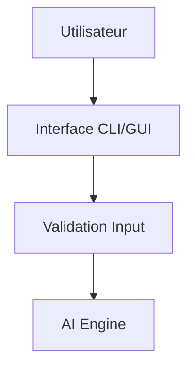
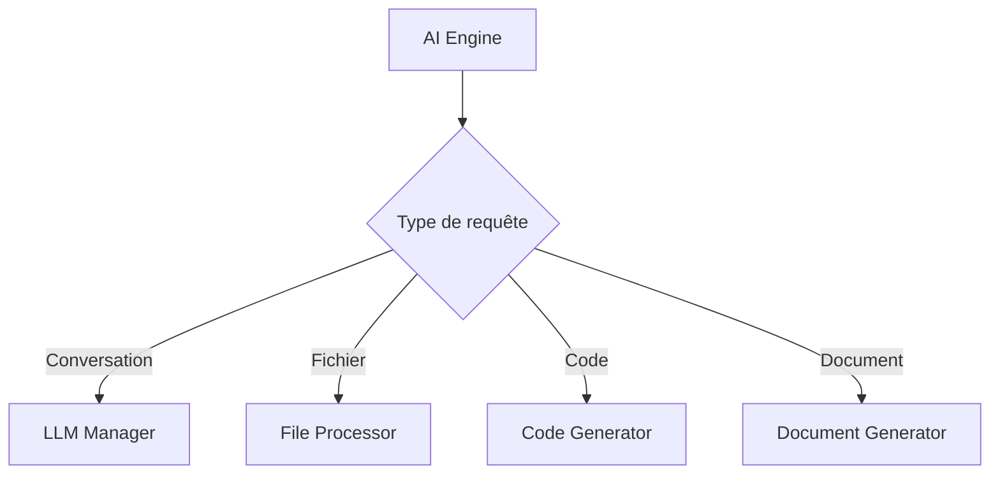

# 🏗️ Architecture - My Personal AI (100% Local)

## 📋 Vue d'Ensemble de l'Architecture

My Personal AI suit une architecture modulaire 100% locale basée sur les principes suivants:

- **Fonctionnement entièrement local** : Aucune dépendance externe requise
- **Reconnaissance d'intentions avancée** : Analyse linguistique des requêtes utilisateur
- **Mémoire conversationnelle intelligente** : Contextualisation des réponses
- **Modularité et réutilisabilité** : Composants indépendants et testables
- **Extensibilité** : Architecture ouverte pour évolutions futures

## 🏛️ Architecture Générale

```
┌─────────────────────────────────────────────────────────────┐
│                    INTERFACES UTILISATEUR                   │
├─────────────────────────────────────────────────────────────┤
│  GUI Tkinter    │  CLI Click      │  Future: VS Code Ext.   │
│  (Principal)    │  (Expert)       │  (Roadmap)              │
└─────────────────┴─────────────────┴─────────────────────────┘
                              │
┌─────────────────────────────────────────────────────────────┐
│                      MOTEUR IA PRINCIPAL                    │
├─────────────────────────────────────────────────────────────┤
│  • Reconnaissance d'intentions (salutations, code, docs)    │
│  • Gestion de la mémoire conversationnelle                  │
│  • Routage intelligent vers modules spécialisés             │
│  • Formatage adaptatif des réponses                         │
└─────────────────────────────────────────────────────────────┘
                              │
┌─────────────────────────────────────────────────────────────┐
│              COUCHE DE RECONNAISSANCE ET MÉMOIRE            │
├─────────────────┬─────────────────┬─────────────────────────┤
│ PATTERNS LING.  │ CONVERSATION    │ KNOWLEDGE BASE          │
│                 │ MEMORY          │                         │
│ • Intentions    │ • Historique    │ • Connaissances locales │
│ • Salutations   │ • Documents     │ • Patterns de réponses  │
│ • Questions     │ • Code content  │ • Base de données       │
│ • Commandes     │ • Contexte      │ • Apprentissage local   │
└─────────────────┴─────────────────┴─────────────────────────┘
                              │
┌─────────────────────────────────────────────────────────────┐
│                    MODULES SPÉCIALISÉS                      │
├─────────────────┬─────────────────┬─────────────────────────┤
│   PROCESSORS    │   GENERATORS    │    REASONING            │
│                 │                 │                         │
│ • PDF Processor │ • Code Gen.     │ • Logic Engine          │
│ • DOCX Proc.    │ • Document Gen. │ • Decision Making       │
│ • Code Proc.    │ • Response Gen. │ • Context Analysis      │
└─────────────────┴─────────────────┴─────────────────────────┘
                              │
┌─────────────────────────────────────────────────────────────┐
│                      UTILITAIRES                            │
├─────────────────────────────────────────────────────────────┤
│  File Manager  │  Logger  │  Validators  │  Configuration   │
└─────────────────────────────────────────────────────────────┘
```

## 📦 Structure Détaillée des Modules

### 🧠 Core (Cœur du Système)

```python
core/
├── ai_engine.py         # Moteur principal et coordination
├── conversation.py      # Gestion complète des conversations
└── config.py           # Configuration globale et paramètres
```

**Responsabilités:**
- Initialisation et coordination de tous les composants
- Gestion de l'état conversationnel et mémoire persistante
- Routage des requêtes selon les intentions détectées
- Configuration centralisée et gestion des paramètres

### 🤖 Models (Modèles d'IA Locaux)

```python
models/
├── custom_ai_model.py      # Modèle IA principal avec logique d'intentions
├── conversation_memory.py  # Mémoire conversationnelle avancée
├── linguistic_patterns.py  # Reconnaissance patterns et intentions
├── base_ai.py             # Interface de base pour modèles
├── knowledge_base.py      # Base de connaissances locale
└── reasoning_engine.py    # Moteur de raisonnement et logique
```

**Fonctionnalités Clés:**
- **Reconnaissance d'intentions** : Détection automatique salutations, questions code, documents
- **Mémoire contextuelle** : Stockage et récupération documents/code traités
- **Patterns linguistiques** : Analyse avancée des requêtes utilisateur
- **Réponses adaptatives** : Format et contenu selon le type de question

### ⚙️ Processors (Traitement de Fichiers)

```python
processors/
├── pdf_processor.py      # Extraction complète texte PDF
├── docx_processor.py     # Traitement DOCX avec structure
└── code_processor.py     # Analyse et traitement code source
```

**Design Pattern:** Factory Pattern avec mémoire intégrée
- Détection automatique du type de fichier
- Stockage du contenu dans la mémoire conversationnelle
- Interface standardisée avec gestion d'erreurs

### 🏭 Generators (Génération de Contenu)

```python
generators/
├── document_generator.py  # Génération documents contextuels
├── code_generator.py     # Génération et suggestions de code
└── [future modules]      # Extensions futures
```

**Design Pattern:** Template Method Pattern avec contexte
- Templates réutilisables
- Personnalisation par type de contenu
- Validation et post-traitement

### 🖥️ Interfaces (Interfaces Utilisateur)

```python
interfaces/
├── cli.py               # Interface ligne de commande
├── gui.py              # Interface graphique (futur)
└── vscode_extension.py  # Extension VS Code (futur)
```

**Design Pattern:** Command Pattern
- Commandes encapsulées
- Historique et undo possibles
- Interface unifiée

### 🛠️ Utils (Utilitaires)

```python
utils/
├── file_manager.py      # Gestion fichiers
├── logger.py           # Logging et métriques
└── validators.py       # Validation et sécurité
```

**Responsabilités transversales:**
- Gestion des fichiers et répertoires
- Logging structuré avec métriques
- Validation des entrées utilisateur

## 🔄 Flux de Traitement

### 1. Réception de Requête



### 2. Analyse et Routage

```python
def _analyze_query_type(self, query: str) -> str:
    """Analyse le type de requête pour routage"""
    if "fichier" in query.lower():
        return "file_processing"
    elif "code" in query.lower():
        return "code_generation"
    elif "document" in query.lower():
        return "document_generation"
    else:
        return "conversation"
```

### 3. Traitement Spécialisé



### 4. Génération de Réponse

```python
response = {
    "type": "conversation|file_processing|code_generation|document_generation",
    "success": True|False,
    "message": "Réponse textuelle",
    "code": "Code généré (si applicable)",
    "document": "Info document (si applicable)",
    "metadata": {...}
}
```

## 🎯 Patterns Architecturaux Utilisés

### 1. **Dependency Injection**
```python
class AIEngine:
    def __init__(self, llm_manager=None, file_manager=None):
        self.llm_manager = llm_manager or LocalLLMManager()
        self.file_manager = file_manager or FileManager()
```

### 2. **Factory Pattern**
```python
def create_processor(file_path: str) -> BaseProcessor:
    ext = Path(file_path).suffix.lower()
    if ext == '.pdf':
        return PDFProcessor()
    elif ext == '.docx':
        return DOCXProcessor()
    # ...
```

### 3. **Strategy Pattern**
```python
class LocalLLMManager:
    def __init__(self):
        self.backends = {
            'ollama': OllamaClient(),
            'transformers': TransformersClient()
        }
        
    def generate_response(self, prompt, backend=None):
        backend = backend or self.active_backend
        return self.backends[backend].generate_response(prompt)
```

### 4. **Observer Pattern**
```python
class ConversationManager:
    def add_exchange(self, user_input, ai_response):
        # Notifie les observateurs (logger, analytics, etc.)
        for observer in self.observers:
            observer.on_exchange_added(user_input, ai_response)
```

## 🔒 Principes de Sécurité

### Validation des Entrées
```python
# Validation à plusieurs niveaux
user_input -> InputValidator -> SecurityValidator -> AI Engine
```

### Isolation des Processus
- Chaque processeur de fichier est isolé
- Validation avant exécution de code
- Sandbox pour les opérations dangereuses

### Gestion des Erreurs
```python
try:
    result = await processor.process(file)
except SecurityException as e:
    logger.warning(f"Security issue: {e}")
    return {"error": "Opération non autorisée"}
except Exception as e:
    logger.error(f"Processing error: {e}")
    return {"error": "Erreur de traitement"}
```

## 📈 Évolutivité et Extensibilité

### Ajout de Nouveaux Backends LLM
```python
# Implémentation de l'interface LLMBackend
class NewLLMClient(LLMBackend):
    async def generate_response(self, prompt, context=None):
        # Implémentation spécifique
        pass
    
    def is_available(self):
        # Test de disponibilité
        pass
```

### Ajout de Nouveaux Processeurs
```python
# Nouveau processeur pour format spécifique
class ExcelProcessor(BaseProcessor):
    def process(self, file_path):
        # Logique de traitement Excel
        pass
```

### Ajout de Nouvelles Interfaces
```python
# Interface web, mobile, etc.
class WebInterface(BaseInterface):
    def handle_request(self, request):
        # Traitement requête web
        pass
```

## 🔧 Configuration et Customisation

### Configuration Hiérarchique
```
config.yaml (défaut) -> .env (environment) -> args (runtime)
```

### Hooks et Extensions
```python
class AIEngine:
    def __init__(self):
        self.hooks = {
            'pre_process': [],
            'post_process': [],
            'on_error': []
        }
    
    def register_hook(self, event, callback):
        self.hooks[event].append(callback)
```

## 📊 Monitoring et Métriques

### Logging Structuré
```python
logger.info("Request processed", extra={
    "request_id": uuid.uuid4(),
    "user_query": query_hash,
    "processing_time": elapsed,
    "backend_used": backend_name
})
```

### Métriques de Performance
- Temps de traitement par type de requête
- Taux de succès par backend
- Utilisation mémoire et CPU
- Cache hit rate

Cette architecture garantit une évolutivité maximale tout en maintenant la simplicité d'utilisation et la robustesse du système.
